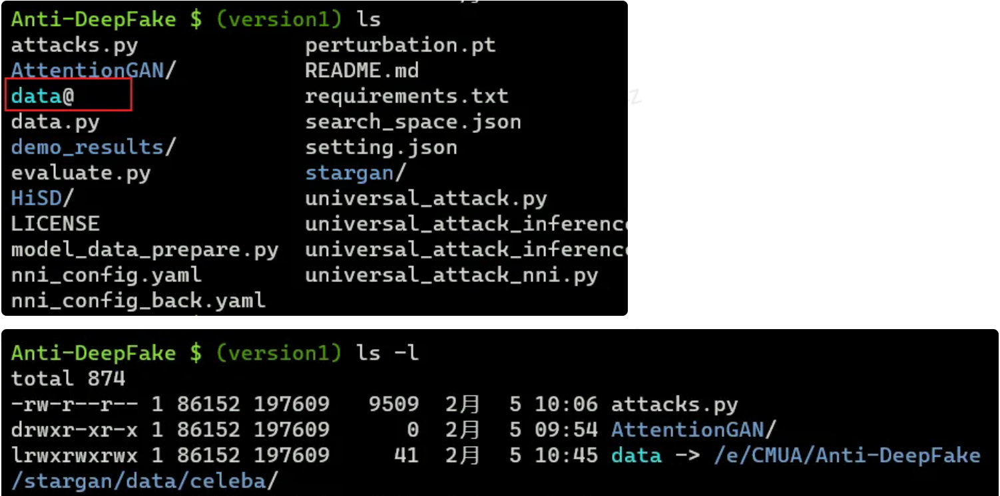

# Anti-Deepfake-Watermark

- An implementation of the paper [CMUA-Watermark: A Cross-Model Universal Adversarial Watermark for Combating Deepfakes](https://arxiv.org/abs/2105.10872) (AAAI2022).

## Configuration

### 1. Python 环境

> Python 3.6 or Python 3.7 (更高版本尚未尝试) (对应的包版本皆为对应 python 版本中的最新版本)

- install the lib by pip (推荐 conda or pipenv)

```
pip install -r requirements.txt
```

### 2. 准备数据集

- 下载 CelebA 数据集:

```
cd stargan
bash download.sh celeba
```

- 如果下载不成功，可以将 download.sh 中 wget 部分注释掉，手动下载压缩包并放到 stargan/data 目录下，然后运行脚本解压。

```
if [ $FILE == "celeba" ]; then

    # CelebA images and attribute labels
    URL=https://www.dropbox.com/s/d1kjpkqklf0uw77/celeba.zip?dl=0
    ZIP_FILE=./data/celeba.zip
    mkdir -p ./data/
    wget -N $URL -O $ZIP_FILE
    unzip $ZIP_FILE -d ./data/
    rm $ZIP_FILE
```

下载成功后，data 目录下应该有以下文件：

```
data
└── celeba
    ├── img_align_celeba
    ├── ├── ...
    │   ├── 202598.jpg
    │   └── 202599.jpg
    └── list_attr_celeba.txt
```

> 可能需要你把文件夹的名字改一下

- 在根目录创建软连接

```
# 在 linux/MacOS 系统下
ln -s stargan/data/celeba ./data
# 在 windows 系统下 (可能需要用绝对路径)
mklink /D data stargan\data\celeba
```

创建好可以看到这样的效果：



### 3. 加载模型的权重

- 将百度网盘中的权重解压缩后移动到相应的位置（需要你先创建相应的文件夹）

```
mkdir -p ./stargan/stargan_celeba_256/models
mkdir -p ./AttentionGAN/AttentionGAN_v1_multi/checkpoints/celeba_256_pretrained
mkdir -p ./HiSD

cd Anti-Deepfake
mv ./weights/stargan/* ./stargan/stargan_celeba_256/models
mv ./weights/AttentionGAN/* ./AttentionGAN/AttentionGAN_v1_multi/checkpoints/celeba_256_pretrained
mv ./weights/HiSD/* ./HiSD
```

- 如果要进行 inference, 将网盘中的 pt 模型放到根目录下

随后运行

```
# inference in CelebA datasets with 20 images (you can change the test number in evaluate.py)
python3 universal_attack_inference.py

# inference with your own image (one image)
python3 universal_attack_inference_one_image.py
```

## 训练模型

使用 NNI 工具，搜索 step size, 相应配置文件是 `nni_config.yaml` 和 `search_space.json`

```
nnictl create --config ./nni_config.yaml
```

> 具体配置需要自行搜索一下，主要是 GPU 部分

得到超参后，修改 `setting.json` 中的 step size，然后运行

```
python3 universal_attack.py
```